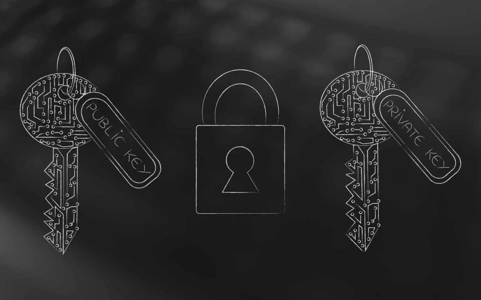

<div align="center">

# SecureSuite 🛡️

**A unified desktop application combining a powerful cryptography toolkit with a robust steganography tool.**

[](https://opensource.org/licenses/MIT)




</div>

<br>

> **SecureSuite** is a powerful and user-friendly desktop application that brings two critical security tools into one place:
> * **CryptoSuite 🔐**: A lightweight, recipe-based toolkit for encrypting, decrypting, encoding, and decoding data.
> * **Steganography Suite 🖼️**: A robust tool to hide secret messages within images using advanced steganography and strong AES-256 encryption.

---

## ✨ Key Features

SecureSuite is designed for students, developers, and security enthusiasts who need a practical yet approachable set of security tools.

### CryptoSuite Features
* **Recipe-Based System**: Chain multiple operations like Base64, Hex, and classic ciphers in a clear, step-by-step workflow.
* **Save & Load Recipes**: Create complex encryption or decryption chains and save them for later use.
* **Modern GUI**: A sleek, dark-themed interface built with CustomTkinter that makes complex operations intuitive.

### Steganography Suite Features
* **Strong Encryption**: All hidden messages are first secured with **AES-256 encryption** and a password processed with PBKDF2 to resist attacks.
* **LSB Steganography**: Uses the Least Significant Bit (LSB) technique to invisibly embed data within image pixels.
* **Drag & Drop**: Easily load images by dragging them directly into the application.
* **Real-Time Size Indicator**: Instantly see the maximum data capacity of an image and your current message size.

---

# ⚠️ Important Warning for Sharing Steganographic Images

Do **not** send the saved image directly through messaging apps like **WhatsApp, Messenger, or social media**.  
These services apply compression to images, which will **destroy the hidden message**.

### ✅ How to Share Safely

- **On WhatsApp:** When sharing, choose Attach ~> `Document` and select your image file. Do not send from the "Gallery."
- **Best Method:** Put the image in a `.zip` archive and send the zip file.  
- **Alternative:** Use a file-sharing service like **Google Drive**, **Dropbox**, or email it as a direct attachment.

---

## 📸 Showcase

### CryptoSuite Workflow
#### ⚡ Encryption & Decryption

<div align="center">
  
  
  <br/>
  <sub>⚡ Encryption</sub>   <sub>🔓 Decryption</sub>
</div>

### Steganography Suite Workflow
#### ⚡ Hide & Extract Message

<div align="center">
  
  
  <br/>
  <sub>🕵️‍♂️ Hide</sub>   <sub>🔍 Extract</sub>
</div>

---

## 💻 Technologies Used

* **Language**: Python
* **GUI**: CustomTkinter, ttkbootstrap, tkinterdnd2
* **Core Logic**: OpenCV, NumPy
* **Encryption**: Cryptography

---

## 🚀 Quick Start

1.  **Clone the Repository**
    ```bash
    git clone [https://github.com/sh4dowkey/SecureSuite.git](https://github.com/sh4dowkey/SecureSuite.git)
    cd SecureSuite
    ```

2.  **Create a Virtual Environment** (Recommended)
    ```bash
    python -m venv .venv
    # On Windows:
    .\.venv\Scripts\activate
    # On macOS/Linux:
    source .venv/bin/activate
    ```

3.  **Install All Dependencies**
    ```bash
    pip install -r requirements.txt
    ```

4.  **Launch the Application**
    ```bash
    python main.py
    ```
    This will open the main CryptoSuite window. You can launch the Steganography tool from the menu (`Tools -> Hide Secret in Image...`) or the side panel.

---


## 📖 Basic Usage

### Launching the Suite

After following the installation steps, launch the main application window from the root `SecureSuite` directory:

```bash
python main.py
```

The application will open to the **CryptoSuite** tool by default.

### Using CryptoSuite 🔐

The CryptoSuite is designed around a simple, step-by-step "recipe" workflow.

1.  Enter your text or data into the **Input** panel on the right.
2.  From the **Operations** sidebar on the left, click on an operation (e.g., "To Base64", "Caesar Encrypt", "Hex") to add it to your recipe in the center panel.
3.  Click the **"Bake Recipe\!"** button to process your input through the entire sequence of operations.
4.  The final result will appear in the **Final Output** panel.
5.  You can save your recipe for later use with the **"Save"** button in the recipe panel.

### Using the Steganography Suite 🖼️

Launch the Steganography tool from within CryptoSuite by navigating to the top menu bar and selecting **`Tools -> Hide Secret in Image...`** or by clicking the **"SecretInImage 🕵️️"** button on the left-side panel.

#### To Hide a Message (Encrypting)

1.  In the **"Hide Message 🖼️"** tab, load a cover image by clicking **"Open Image..."** or by dragging and dropping the file into the preview area.
2.  Type your secret message into the **"Secret Message"** box.
3.  Enter a strong **password** to encrypt your message before hiding it.
4.  Click **"Encrypt & Save Image"** and choose a location to save your new image (as a `.png` file).

#### To Extract a Message (Decrypting)

1.  Switch to the **"Extract Message 🔍"** tab.
2.  Load the image that contains the hidden message.
3.  Enter the correct **password** that was used to hide the message.
4.  Click **"Decrypt & Reveal"**. The hidden message will appear in the **"Decrypted Message"** box.

---

## 📂 Project Structure

```plaintext
SecureSuite/
├── main.py              # The main launcher for the entire suite
├── requirements.txt     # All combined dependencies
│
└── apps/
    ├── cryptosuite/     # Contains the CryptoSuite application
    └── steganography/   # Contains the Steganography application

```

## 🛣️ Roadmap

This is an actively developed project. Planned features include:

- **Auto-Detect Mode ✨:** An intelligent feature in CryptoSuite to analyze input and suggest a possible decryption recipe.

- **AES Encryption:** Full integration of AES encryption & decryption into the CryptoSuite recipe system.

- **Hashing Tab:** A dedicated section in CryptoSuite for common hashing algorithms (MD5, SHA-256).

---


## 🤝 Contributing

Contributions are welcome!  

1. Fork the repo  
2. Create a feature branch (`git checkout -b feat/my-feature`)  
3. Commit your changes (git commit -m 'Add some amazing feature').
4. Push to the branch (git push origin feat/YourAmazingFeature).
5. Open a Pull Request.

Please keep functions small, documented, and covered by unit tests where possible.

---


## 📝 License

This project is released under the **MIT License**.

---


## 🙏 Acknowledgements

Inspired by community cryptography resources and educational projects.

If you find CryptoSuite useful, please ⭐ the repo and consider contributing!

---

<div align="center">
<h3>Author</h3>
<p>Crafted with ❤️ by <b>sh4dowkey</b></p>
<a href="https://github.com/sh4dowkey"> </a>
</div>
